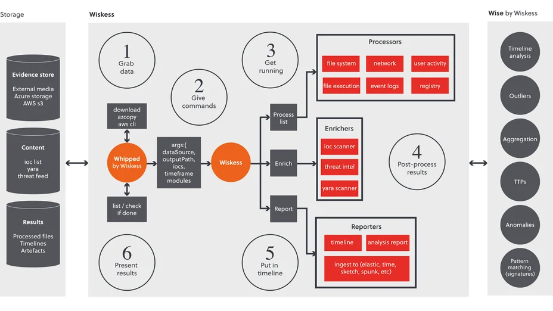

# wiskess_rust
Wiskess automates the Windows evidence processing for incident response and forensic investigations. The overall goal of the tool is to process evidence in the form of logical or physcial collections, i.e. a velociraptor collection or a disk image, then upload the results to Azure or AWS storage. 

Wiskess automates the processing of disk images and triage collection artefacts from Windows systems. It does this with a pipeline involving six steps:

1. Get the data – transfers data from cloud-based storage (i.e. AWS S3, Azure Storage), network drive, etc.
2. Pre-process the data – structures the data into a suitable format for processing
3. Process the data – covers the main artefacts of Windows system with parallel processing
4. Enrich the findings – scans the data and findings with IOCs, yara rules and threat intel feeds
5. Generate reports – timelines all results of the processing in a format compatible with visualisation tools (Elastic, Splunk, Timesketch)
6. Store the results – results can be uploaded to cloud-based storage

# The way of Wiskess


# Tools integrated to Wiskess
This is the Rust version of Wiskess, which uses parallel processing of multiple tools and more can be added. It includes enrichment tools that scan the data source using your IOC list, yara rules, and open source intelligence. 

The results are structured into folders in CSV files that can be opened with text editors and searched across using tools like grep. The tool produces a report of the system info and files that have produced results in the Analysis folder.

The output is generated into reports of a timeline that is compatible with ingesting into visualisation tools including, timesketch, elastic and splunk.

The list of tools used after setup are:

| Developer/Organization      | Tools                                                      |
|-----------------------------|------------------------------------------------------------|
| ANSSI-FR                    | bmc_tools                                                  |
| Nir Soft                    | BrowsingHistoryView                                        |
| Yamato-Security             | hayabusa                                                   |
| obsidianforensics           | hindsight                                                  |
| brimorlabs                  | KStrike                                                    |
| Neo23x0                     | loki                                                       |
| BurntSushi                  | RipGrep                                                    |
| keydet89                    | RegRipper                                                  |
| williballenthin             | shellbags                                                  |
| davidpany                   | CCM_RUA_Finder, PyWMIPersistenceFinder                     |
| omerbenamram                | evtx, mft                                                  |
| WithSecureLabs chainsaw     | evtx, Shimcache, SRUM (System Resource Usage Monitor)      |
| EZTools                     | AmcacheParser, AppCompatCacheParser, EvtxECmd, JLECmd, LECmd, MFTECmd, PECmd, RBCmd, RecentFileCacheParser, RECmd, SBECmd, SrumECmd, SumECmd |
| S-RM                        | polars_hostinfo.py, polars_tln.py, Executablelist.ps1      |
| Whipped Tools               | AzCopy, 7zip, OSFMount                                     |


# Requirements
run `wiskess_rust.exe setup -g <your github token>` using a terminal with Administrator rights. 

The github token needs the minimum permissions to access public github repos. GitHub's guide is here: https://docs.github.com/en/authentication/keeping-your-account-and-data-secure/managing-your-personal-access-tokens#creating-a-fine-grained-personal-access-token

The setup will install tools needed by WISKESS on the operating system and under the tools folder. You will need about 5 GB of disk space for the installation to complete.

# Wiskess Web UI `wiskess_rust.exe gui`
This command will launch the Web user interface. This is still WIP, where currently you can submit two commands to wiskess, including:
* a single data source - using the main wiskess module
* multiple data sources hosted locally, or in the cloud (Azure storage or AWS S3) - using the whipped module


I intend to extend the functionality of the GUI to see the current progress and a view of the processed files and folder. Until then, please review the progress in from the terminal that you launched the Web UI, and review the processed data in either explorer, VSCode or tool of your choice.

# Process configurations
There are multiple configurations that can be used to process data. The default one 'config/main_win.yaml' is designed for use on Windows OS. This includes most of the commonly used process tools of wiskess. If you need a more thorough investigation, and don't mind waiting a bit longer for the processing to complete use `config/intense_win.yaml`. The intense config includes these tools:
* Chainsaw EVTX
* EVTX Dump
* williballenthin Shellbags
* KStrike
* RDP Bitmap
* IOCs over pagefile
* Executablelist
* Loki over the datasource

You can set the process config using the argument `--config my_fav_tools.yaml` in both wiskess and whipped by wiskess commands.

# Whipped by Wiskess `wiskess_rust.exe whipped`
This command will pull data from an AWS or Azure store, process it with wiskess and upload the output to a store.

## Usage
This can be used to process Windows data sources stored on either an Azure or AWS S3 cloud account. It can also be used to process data from a network share or local drive.

### Azure Usage:
* Generate a SAS key from the storage where the data is stored in azure
* Generate a SAS key to where you need the Wiskess output to be uploaded to in azure
* Copy the file path of all the data you need processed, this needs to be the same as the path in Azure
* Set a start and end time, which is likely the incident timeframe

### AWS Usage:
* Add to your session or terminal the AWS credentials for the account where the data is stored in S3
* Get the s3:// link to where the data source is stored
* Create a bucket or folder in AWS S3, where you need the Wiskess output to be uploaded to in azure. Get that s3:// link too.        
* Copy the file path of all the data you need processed, this needs to be from the folder or bucket that you got the s3:// link.     
* Set a start and end time, which is likely the incident timeframe

## Example
```
wiskess_rust.exe whipped --config ./config/win_all.yml `
        --data-source-list "image.vmdk, folder with collection, surge.zip, velociraptor_collection.7z" `
        --local-storage x: `
        --in-link "https://myaccount.file.core.windows.net/myclient/?sp=rl&st=...VWjgWTY8uc%3D&sr=s" `
        --out-link "https://myaccount.file.core.windows.net/internal-cache/myclient/?sp=rcwl&st=2023-04-21T20...2FZWEA%3D&sr=s" `
        --start-date 2023-01-01 `
        --end-date 2023-02-01 `
        --ioc-file ./iocs.txt
```

## Parameters
<details>
    <summary>Click to show the parameters for `wiskess_rust.exe whipped`</summary>
    
    --config <String>
        Optional. The paths to the configuration file, i.e. ./config/win_all.yml
            
    --data-source-list <String>
        Required. The paths to the file, folder of images, collections, etc. Must be separated by comma ',' or new line

    --local-storage <String>
        Required. The path to where the data is temporarily downloaded to and Wiskess output is stored locally

    --in-link <String>
        Required. The link that the data is stored on, i.e.
        https://myaccount.file.core.windows.net/myclient/?sp=rl&st=...VWjgWTY8uc%3D&sr=s

    --out-link <String>
        Required. The link where you need the wiskess output uploaded to, i.e.
        https://myaccount.file.core.windows.net/results/myclient/?sp=rcwl&st=2023-04-21T20...2FZWEA%3D&sr=s

    --ioc-file <String>

    --start-date <String>
        Required. The start time from when we want to look for interesting information. Normally aligned with the incident timeframe.    
        Caution: specifying a wide timeframe will cause performance issues.

    --end-date <String>
        Required. The end time to when we want to look for interesting information. Normally aligned with the incident timeframe.        
        Caution: specifying a wide timeframe will cause performance issues.

    --update
        Optional. Set this flag to update the Wiskess results, such as changing the timeframe or after adding new IOCs to the list.      

    --keep-evidence
        Optional. Set this flag to keep the downloaded data on your local storage. Useful if wanting to process the data after Wiskess.  
        Caution: make sure you have enough disk space for all the data source list.
</details>
    
# Wiskess `wiskess_rust.exe wiskess`
This is the Rust version of Wiskess, which uses parallel processing of multiple processors, enriches the data and creates reports. It is invoked by the command `wiskess_rust.exe whipped`, but can also be used independently with the command `wiskess_rust.exe wiskess`.

## Usage
* Mount the image to a drive, i.e. using Arsenal Image Mounter. Can be skipped if using a folder of artefacts.
* Provide the file path to the artefacts. Such as the drive it has been mounted, being the drive letter it was originally located on. Or the file path to the folder it was extracted/downloaded to.
* Provide the output path, where you want to store collected artefacts and the results.
* Add your indicators to a file, you can call it iocs.txt and place it in the same folder as wiskess.ps1, or specify the location of your file with the flag -iocFile "path_to_your_iocs.txt"
* The script has a set of predefined locations of Windows artefacts, which it uses to pass to the right parser. If the artefact is not found at the default location, it will ask the user to enter the path to it.

## Parameters
<details>
    <summary>Click to show the parameters for `wiskess_rust.exe wiskess`</summary>
        
    --config <String>
        Optional. The paths to the configuration file. Default: ./config/main_win.yml
            
    --data-source <String>
        Required. The drive letter the image is mounted on, or the file path to the extracted collection.

    --out-path <String>
        Required. Where you want to store the analysis and artefact results.

    --ioc-file <String>
        Optional. The path to a file containing a list of indicators of compromise. Each indicator is on a separate line.

    --start-date <String>
        Optional. The start time from when we want to look for interesting information. Normally aligned with the incident timeframe.    
        Caution: specifying a high number of days will cause performance issues.

    --end-date <String>
        Optional. The end time to when we want to look for interesting information. Normally aligned with the incident timeframe.        
        Caution: specifying a high number of days will cause performance issues.

</details>

## Examples for wiskess
## EXAMPLE 1

Minimum arguments required to collect artefacts from E:, with a quick triage of the last 7 days and storing results to Z:\Project file path. And provide a list of indicators in a file path.
```
    ./wiskess_rust.exe wiskess --data-source E: -out-path "Z:\Project" --start-date 2023-01-01 --end-date 2023-02-01 --ioc-file ./iocs.txt

```

# TODO

The WISKESS project has several areas of development including bug fixes, performance enhancements and capability improvements. Here's a short list of those for your understanding of the known issues, potential and roadmap.

## Known Issues
The following are known issues that are being worked on for the next release:
* IOC summary CSV has extra lines, isn't formatted correctly

## Feature requests
This list includes proposed improvements to wiskess:
* Additional fields added to timeline, i.e. username from profile file path in registry, jump-lists and lnk-files
* Timeline output of iis logs, AV logs
* Timelined output of DNS logs of the Microsoft UAL logs, which allow a look up of the IP address mapped to a hostname

## Performance enhancements
There are several areas where WISKESS can improve in terms of speed, usability and interoperability. These requests are listed here:
* Auto-update from the latest release
* Storing the github token in a config file
* integrate whipped_imageprocess.ps1 to rust whipped
* Move of files from collection or image is done in parallel

## Completed developments for next release
The following are a list of developments since the last release and are currently pushed to the repo:
* Timeline file for PowerShell history files, ConsoleHost_history.txt
* Tests to confirm the WISKESS has been setup, and reporting any missing packages
* Removed bloat-data in the message field of some timeline files, i.e. shellbags, hayabusa
* Fixed an issue in the network CSV in timeline, where multiple entries were shown for the same event
* Fixed an issue with old-whip and GUI when using whipped, where some collections would not be extracted completely
* Host information sheet in timeline